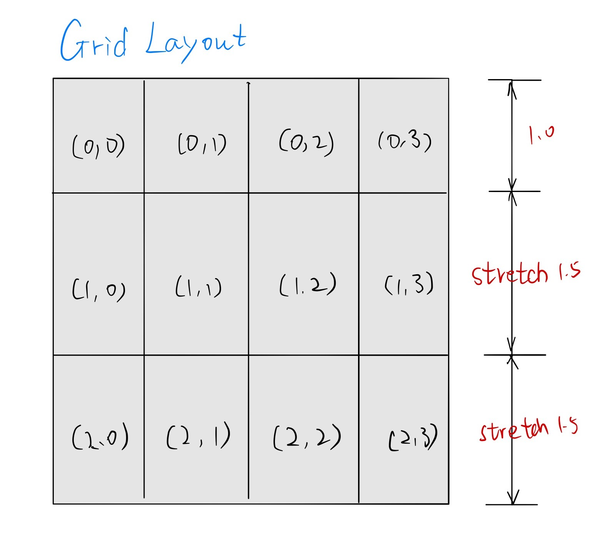

# 曲线拟合项目个人心得报告

> Author:**周章华**
> Date:    2019/7/14
> Stu ID:  3170104922

### 项目分工任务

本次项目，在不同的迭代轮次中，我具体的负责了以下内容

**第一轮迭代**

负责viewmodel层和model层的搭建以及app层组装

**第二轮迭代**

负责view层添加图像的显示,添加图像显示的功能

**第三轮迭代**

负责model层与算法层，增加更多函数拟合选项

### 实现细节

##### **`model`层与`viewmodel`层的绑定与数据交流：**

​        `model`类中主要包含`common`层定义基类`function`的成员变量，指向样本点的共享指针`sp_samplepoints`,以及指向由拟合出的函数方程计算得出的绘图点的共享指针`xy_points`，对`samplepoints`进行处理得到拟合函数的方法`opcf_fit()`. ，`get_function()` `get_xypoints() ` 等用于暴露数据的方法。

​        `viewmodel`类中主要包括暴露`model`层数据的`getFunction()` `getRealPoints()`方法，传递指令的`m_cmdFit`成员变量，接受通知的`m_sink`变量，调用`model`层方法的`call_model_fit(param_opcf&p)`方法

​        `model`层与`viewmodel`层的绑定通过`viewmodel`层的`setmodel()`方法,将`viewmodel`的共享指针成员`m_model`指向`model`,并且将`viewmodel`的接口`m_sink`添加到`model`的通知对象中。


##### **`app`层的组装：**

`app`层包含指向`model` `viewmodel`的共享指针，以及一个`mainwindows`类对象。

通过`set_function(viewmodel->getFunction())` `set_real_points(viewmodel->getRealPoints())` 方法得到`model`层暴露的数据，通过`set_runCommand(viewmodel->get_fitCommand())`向`viewmodel`层发出指令。

通过`viewmodel->AddPropertyNotification()`以及`viewmodel->AddCommandNotification()`方法得到`model`层数据变动提醒。


##### `view`层图像的绘制功能：

​	`view`层通过`QChart`来绘制图像，通过将暴露出的样本点添加到`series`中，然后将图像画出。这一步骤的关键有两个：将`chartview`放置在主程序界面以及显示范围的确定。

​	前者我们通过设置`layer`来解决，后者在`model`层计算作图点的时候同时记录作图点的范围，利用绑定机制，将范围暴露给`view`层。


##### 函数图像样本点值在鼠标移动到点上的显示

​	这一功能经过自习阅读`Qt`帮助文档后，我发现`QScatterSeries`类有一个`hovered()`槽信号，当鼠标移动到点上时触发。`connect(samplepoints_o, &QScatterSeries::hovered, this, &MainWindow::slotPointHoverd);`同时利用一个`QLabel`来显示值。


##### 直接在图像上用鼠标点击添加点

​	这一功能的实现主要遇到了鼠标坐标与表格中的值的对应问题。一开始很难找到简易且有效的方法，开始考虑过获取鼠标坐标后计算得出，但是这样计算的到的值不精确，而且如果界面大小变化后这一方法计算得出的结果会出问题。在自习阅读`Qt`帮助文档后，我发现了有一些坐标转换函数，能够将坐标直接转化成`QChart`上的坐标，不过由于我们将`ChartView`直接添加到了主界面，所以转换步骤比较复杂。

```c++
		auto const widgetPos = e->pos();
		auto const scenePos = chartView->mapFromGlobal(widgetPos);
		auto const chartItemPos = chartView->mapToScene(scenePos);
		auto const picval = chartView->chart()->mapFromScene(chartItemPos);
```

​	可以看到，鼠标坐标经过四次转换才变成了实际值。

##### 函数图像区设计

​	分为初始界面的坐标轴图像，以及运行以后的函数图像。初始界面函数图像坐标轴范围设计为[-100,100]，运行后坐标轴范围由具体样本点决定。
	在图像区，同时显示样本点和函数图像，当鼠标移动到函数图像或者样本点上时，显示当前点的坐标
	在添加点模式中，选中工具栏里的点工具，在函数图像中单击添加点，同时刷新数据，将添加的点显示在表格中。
	在移动点模式中，双击选中样本点，再单击将样本点移动到新的位置。

##### UI布局设计
​	通过GridLayout实现网格化分区布局。在这种模式中，界面被分为m*n个小网格，我们可以把单个网格或者相邻的多个网格分配给不同的组件。
	通过setAlignment函数实现对齐操作
	通过setStretch函数实现网格的拉伸，获得更加丰富的界面布局效果。



实现如下：

```
	       void MainWindow::setLayout()
	       {
	       	table->setMaximumWidth(400);
	       	error_label_pic->setAlignment(Qt::AlignCenter);
	       	m_layout->addWidget(table, 0, 0, 2, 1);
	       	m_layout->addWidget(chartView, 0, 1);
	       	m_layout->addWidget(error_label_pic, 0, 1);
	       	m_layout->addWidget(functionText, 1, 1);
	       
	       	m_layout->setColumnStretch(0, 3);
	       	m_layout->setColumnStretch(1, 5);
	       	m_layout->setRowStretch(0, 3);
	       	m_layout->setRowStretch(1, 1);
	       
	       	centralWidget->setLayout(m_layout);
	       }
```
##### 对数函数拟合算法

其基本形式如下：
$$
y = aInbx
$$
利用对数函数性质，上式可化为
$$
\frac{y}{a}=Inbx
$$
采用最小二乘法求上式可得其二次项为
$$
E=(Inb+Inx-\frac{y}{a})^2
$$
对E跟据a，b求偏导，且使所得值等于0
$$
\frac{\partial E}{\partial a} = \frac{\partial E}{\partial b}  = 0
$$
解上述方程可得
$$
a=\frac{n*\sum yInx -\sum y * \sum Inx}{n*\sum In(x^2)-(\sum Inx)^2}\\
Inb=\frac{\sum y * \sum Inx - b*(\sum Inx)^2}{n * b * \sum Inx}\\
b = e^{Inb}
$$
再将函数式转换成字符串形式。

##### 指数函数拟合算法

其基本形式如下
$$
y = ae^{bx}
$$
该方程可化为
$$
Iny - Ina = bx
$$
采用最小二乘法求参数可得其二次项为
$$
E = (Iny -Ina-bx)^2
$$
基于Ina,b对该二次项求偏导，并使其结果等于0：
$$
\frac{\partial E}{\partial Ina} = \frac{\partial E}{\partial b}  = 0
$$
可得如下所示增广矩阵
$$
T = \left[
\matrix{
\sum n& \sum x &  \sum Iny\\
\sum x & \sum x^2 & \sum xIny\\
}
\right]
$$
解上述增广矩阵可得
$$
b =\frac{n*\sum yInx - \sum y * \sum Inx}{n * \sum In(x^2) - (\sum Inx)^2}\\
Ina = \frac{\sum y * \sum Inx - b * (\sum Inx)^2}{n * b * \sum Inx}\\
a = e^{Ina}\\
$$
再将函数式转换成字符串形式。


### 心得体会

​	本次小学课程**C++项目管理及工程实践**着实让人收获颇丰，我学会了许多新概念、新方法。

​	以前虽然有github账号，也有安装了git，但经过这次课程才深刻体会到git的实用与强大之处。不仅可以保存各个版本，而且保存了各个版本的修改，同时支持多人的merge操作。了解git之后，感觉自己比以前那个拿QQ传项目文件，手动添加修改内容的菜鸟阶段瞬间提高了一个等级。

​	其次还学会了MVVM模型的概念并应用到我们的项目中。MVVM框架下，底层代码实现与界面实现分离，这就大大降低了模块间的耦合程度，是真正的并行编程，并行开发成为可能，而不需要再去等待前一个模块的完成。

​	在课程开始的时候，初次接触到MVVM模型这一概念的我还是比较懵的，所以被老师戏称为“菜鸟”队。不过“菜鸟”就得先飞，作为菜鸟二号的我每天都是最早爬起到教室之一，同样也有几个深夜奋战的夜晚，通读了两遍老师的示例代码。在此也要感谢我的“菜鸟”队友们，大家都非常的努利，撸起袖子加油干，git的commit记录中可以看到好几个在深夜的提交。菜鸟们的辛苦也得到了回报，菜鸟队是最早通过老师一轮迭代检验的队伍，或者说，菜鸟队是所有队伍中第一支学会MVVM模型的队伍。在此在此感谢我的队友们，所有成果的获得，都离不开大家共同的奋斗。

### 对课程的改进意见

​	老师讲课有些快，很多ppt上提及的C++的方法在OOP课上都没讲过或者略讲了，希望老师能详述下这些内容。另外希望老师能够在讲解MVVM模型的时候同时讲解附带的demo程序，自己独自看懂`ICommandBase`和各种`sink`需要花很多时间(主要是刚接触有点懵)，感谢老师。

​	

