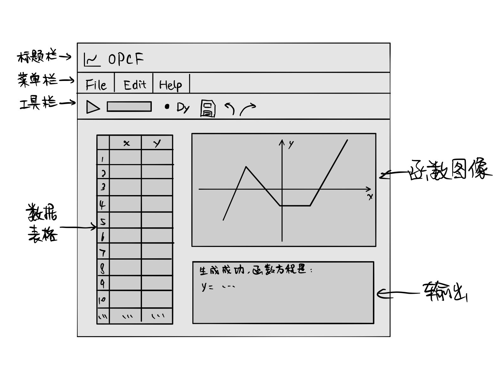
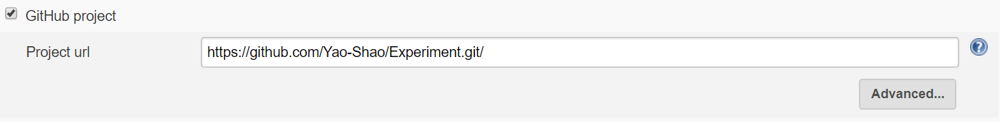
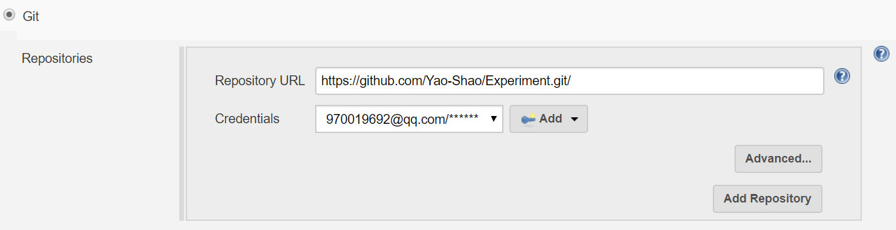
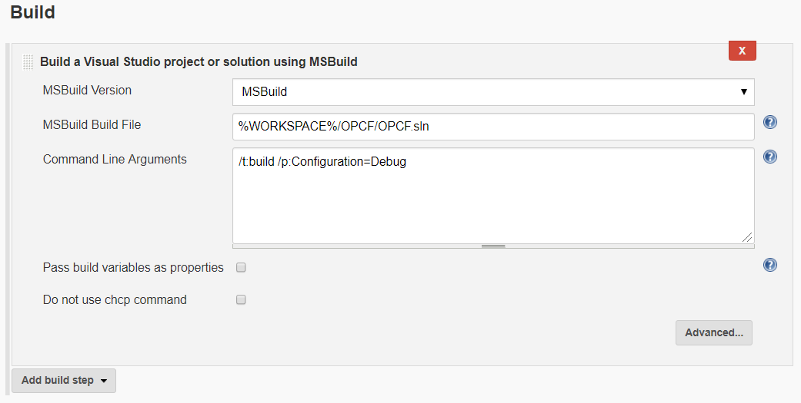
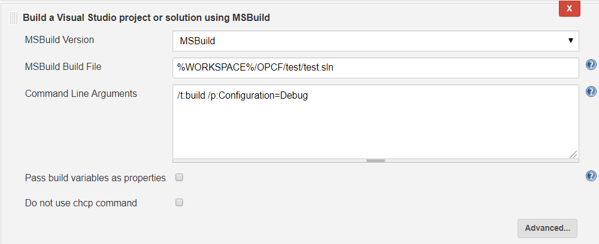
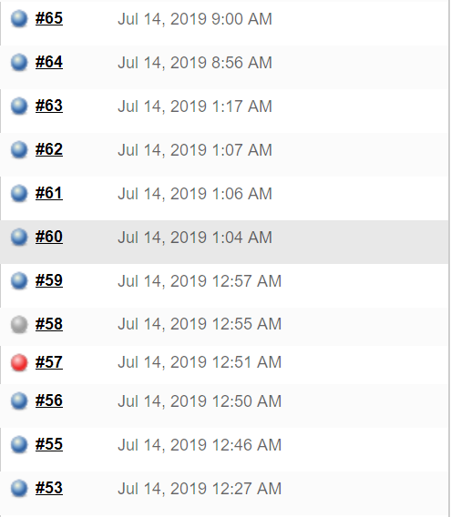
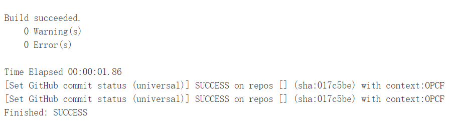

# OPCF个人报告

## 第一轮迭代

1. 分工

   - view层框架设计
   - `Jenkins`持续集成环境搭建

2. 解决方案

   - 基于Qt13.0设计GUI界面，通过信号与槽函数机制实现用户交互功能，基于`MVVM`模型架构解开耦合，高效并行开发。
   - 将`Jenkins`与`Github`仓库绑定，通过轮询机制和`MSBuild`插件实现工程的自动编译、测试和发布。

3. 设计思路

   - view层框架设计

     - 分为两个窗口，主窗口由菜单栏、工具栏、表格、函数图像区和输出信息区组成，各区域通过`Qt`的layout库实现固定排版和缩放功能。子窗口为导函数显示窗口，在用户触发导函数生成按钮时弹出。

       

     - 通过信号与槽函数（signal and slot）获取用户操作信息并做出反馈。

       

     - 基于MVVM模型开发，在View层中定义自己的变量和函数，在App层实现数据、命令和通知的绑定，当用户操作时，View层向ViewModel层发送命令，之后接收ViewModel层的通知，更改为新状态。

       

       App层中要完成属性、命令和通知的绑定：

       ```c++
       // binding properties
       _mainwindow.set_function(viewmodel->getFunction());
       _mainwindow.set_real_points(viewmodel->getRealPoints());
       _mainwindow.set_range_x(viewmodel->getRangeX());
       _mainwindow.set_range_y(viewmodel->getRangeY());
       _mainwindow.set_sample_points(viewmodel>getSamplePoints());
       _mainwindow.set_dy_points(viewmodel->getDyPoints());
       //command
       _mainwindow.set_runCommand(viewmodel->get_fitCommand());
       //notifications
       viewmodel>AddPropertyNotification(_mainwindow.get_updateSink());
       viewmodel>AddCommandNotification(_mainwindow.get_runSink());
       ```

       例如，当用户点击运行按钮时，运行信号触发运行槽函数，调用SetParameter函数传递参数，调用Exec函数发送执行命令：

       ```c++
       m_cmdRun->SetParameter(m_param);
       m_cmdRun->Exec();
       ```

       计算完成后，ViewModel层发送通知，触发view层中的刷新函数：

       ```c++
       void updateSink::OnPropertyChanged(const std::string& str)
       {
       	if (str == "Function")
       	{
       		ptr_mainwindow->update();
       	}
       	else {
       		ptr_mainwindow->run_error(str);
       	}
       }
       ```

     - 菜单栏

       基于`Qt`的`MenuBar`库实现

       ```c++
       /* File */
       QMenuBar* pmenuBar = menuBar();
       QMenu* fileMenu = pmenuBar->addMenu("File");
       QAction* openAction = new QAction("Open Project");
       openAction->setShortcut((Qt::CTRL | Qt::Key_O));
       fileMenu->addAction(openAction);
       connect(openAction,SIGNAL(triggered()),this,SLOT(openFile()));
       ```

     - 工具栏

       基于`Qt`的`ToolBar`库实现

       ```
       QToolBar* toolBar = addToolBar("Tool");
       /* Runing */
       QToolButton* runAction = new QToolButton(this);
       runAction->setShortcut(Qt::CTRL | Qt::Key_R);
       runAction->setIcon(QIcon(":/OPCF/img/running.png"));
       runAction->setToolTip(tr("Show fit curve"));
       toolBar->addWidget(runAction);
       connect(runAction,SIGNAL(clicked()),this,SLOT(runActionTrigger()));
       ```

     - 数据表格

       基于`Qt`的`Table`库实现

     - 输出信息显示

       基于`Qt`的`PlainText`组件实现，没有选用`EditText`库的原因是，输出信息是只读的，而`EditText`可编辑。

   - `Jenkins`环境搭建

     - `Jenkins`下载与安装，`MSBuild`和`Git`插件安装，`MSBuild`路径绑定。

     - `Jenkins`与`Github`的绑定。

     - `Jenkins`项目创建：

       选择自由类型的项目，输入`Github`库地址以及对应的`Git`仓库地址：

       

       

       添加编译项目，使用MsBuild命令行执行编译，输入工程文件的相对路径：

       

       再添加一个编译项目，用于测试代码的编译执行：

       

       编译测试成功后可以向`Github`发送成功的通知。由于我们没有自己的服务器，无法完成这一步，可以直接在`Jenkins`中观察结果。

4. 运行效果

   - 程序部分见总报告。

   - `Jenkins`

     运行历史：

     

     运行结果：

     

## 第二轮迭代

1. 分工

   - model层与算法层的修改，多项式函数拟合算法。

2. 解决方案

   - 使用`最小二乘法`进行函数拟合。

3. 设计思路

   - **一次函数**

     其基本形式如下：

   $$
   y = ax + b
   $$

    	我们对一次函数的拟合采用基于最小二乘法的算法，以期减小误差。其					二次项表达式如下：
   $$
   E = (ax+b-y)^2
   $$
   ​     	为了使得到的曲线误差最小我们需得到如下拟合条件：
   $$
   \frac{\partial E}{\partial a} = \frac{\partial E}{\partial b} = 0
   $$
   ​    	解以上偏微分方程可得如下所示增广矩阵
   $$
   T = \left[
   \matrix{
   \sum x^2 & \sum x & \sum xy\\
   \sum x & n & \sum y\\
   }
   \right]
   $$
    	解如上所示增广矩阵矩阵可得出所需a，b值，再将函数式转换成字符串形式。

   - **二次函数**

     其基本形式如下：

   $$
   y=ax^2 + bx + c	
   $$

      	我们对二次函数的拟合采用基于最小二乘法的算法，其二项表达式如下：
   $$
   E=(ax^2+bx+c)^2
   $$
   ​	为了使得到的曲线误差较小我们采取对其参数求偏导来计算参数
   $$
   \frac{\partial E}{\partial a} = \frac{\partial E}{\partial b} = \frac{\partial E}{\partial c} = 0
   $$
   ​	解以上常微分方程可以得到如下增广矩阵
   $$
   T = \left[
   \matrix{
   \sum x^4 & \sum x^3 & \sum x^2 & \sum x^2y\\
   \sum x^3 & \sum x^2 & \sum x & \sum xy\\
   \sum x^2 & \sum x & n & \sum y
   }
   \right]
   $$
   ​	解如上所示增广矩阵可得出所需a，b，c值，再将函数式转换成字符串形式。

   - **三次函数**

     其基本形式如下：

   $$
   y = ax^3+bx^2+cx+d
   $$

   ​	我们对三次函数的拟合采取最小二乘法的策略，其二次项表达如下
   $$
   E=(ax^3+bx^2+cx+d-y)^2
   $$
   ​	基于最小二乘法求参数算法，我们基于其二次项表达式，分别对a，b，c，d求偏导，并使所得值等于0
   $$
   \frac{\partial E}{\partial a} = \frac{\partial E}{\partial b} = \frac{\partial E}{\partial c} = \frac{\partial E}{\partial d}= 0
   $$
   ​	解上述偏微分方程，可得如下增广矩阵
   $$
   T = \left[
   \matrix{
   \sum x^6 & \sum x^5 & \sum x^4 & \sum x^3 & \sum x^3y\\
   \sum x^5 & \sum x^4 & \sum x^3 & \sum x^2 & \sum x^2y\\
   \sum x^4 & \sum x^3 & \sum x^2 & \sum x & \sum xy\\
   \sum x^3 & \sum x^2 & \sum x & n & \sum y
   }
   \right]
   $$
   ​	使用高斯消元法解以上增广矩阵可以得出所需a，b，c，d值，再将函数式转换成字符串形式。

4. 运行结果

   见总报告

## 第三轮迭代

1. 分工

   - `ViewModel`层支持更多函数拟合类型
   - 导入Excel数据的功能
   - 清除数据的功能

2. 实现方案

   - 基于`QAxObject`库实现excel文件的读取操作
   - 基于`MVVM`模型实现多种函数拟合类型通知

3. 设计思路
   - Excel文件读取

     - 在加载Excel文件前，先检测当前工程是否已保存，若未保存，提醒用户先保存文件。

     - 定义excel文件类的一个实例，使用`QuerySubObject`函数设置工作表、文件名、表单标号、绑定行数值和所有数据，使用`toList`函数将数据转换为列表形式。

     - 遍历列表，将数据读入内存，写入表格。

     - 关闭文件。

       ```C++
       QAxObject excel("Excel.Application");
       QAxObject* workbook = workbooks->querySubObject("Open(QString, QVariant)", fileName);
       QAxObject* worksheet = workbook->querySubObject("WorkSheets(int)", 1);
       QAxObject* usedrange = worksheet->querySubObject("UsedRange");
       QAxObject* rows = usedrange->querySubObject("Rows");
       int intRows = rows->property("Count").toInt();
       QString Range = "A1:B" + QString::number(intRows);
       QAxObject* allEnvData = worksheet->querySubObject("Range(QString)", Range);
       QVariant allEnvDataQVariant = allEnvData->property("Value");
       QVariantList allEnvDataList = allEnvDataQVariant.toList();
       ```

   - 数据清除功能

     - 分别清除表格、函数图像和输出信息。

4. 运行效果

   见总报告。

# 心得体会

- 通过这次课程实践，我对C++编程规范、团队协作和开发流程有了更深的理解。从最初对各种工具链和MVVM模型一无所知的“菜鸟”，变为第一个完全按照MVVM模型完成一轮迭代、可以向其他同学分享经验的“学霸”，其中的困境与收获只有自己体会最深。因此，我也非常感谢袁昕老师在这十天里耐心、热情的指导，让我能快速的学会最先进的模型和工具，开发出更高效，鲁棒性更强的工具。当然，我也有一些做得不够好的地方，比如对Qt的内存回收机制理解不深入等，我以后会尽力注意改正这些问题。

# 改进意见

- 希望MVVM模型的讲解能更加详细和具体，例如可以结合代码给我们详细介绍一下app、viewmodel、window层的关系，命令和通知机制。这样可以更快更好地理解MVVM模型。