# OPCF总报告

## 问题和背景

### 项目背景

- 目前，有许多软件提供曲线拟合功能，例如`matlab`,`origin`,`excel`等，这些软件功能强大，但是也有不足之处：它们都只能对输入的一组数据点拟合出图像，如果需要修改图像，只能手动修改数据值，而无法在函数图像中直接添加点或移动点实时获取对应函数曲线，便捷性和直观性较差。
- 在各种实际工程设计和科学实验的数据处理过程中，通常有一条预设的曲线，或者一些偏离的样本点，如果能够直接在拟合出的函数图像中对这些点进行移动修改，那么数据的处理无疑会简单直观很多。
- 我们的暑期c++工程就是基于这样的一个需求，目标开发出一款可以直接在图像上对点进行移动，得到拟合曲线的数学工具——**OPCF**(ocular points curve fitting).

### 项目需求

- 美观友好的图形化界面
  - 包括主窗口、菜单栏、工具栏、表格区、函数图像区和信息显示区。
- 主要功能
  - 多种类型的函数拟合，包括一次函数、二次函数、三次函数、指数函数、对数函数和三次样条插值拟合。
  - 直接在图像上添加、移动点的功能。
  - 撤销、重做功能。
  - 保存和载入功能。可以保存工程文件或者只保存函数图像，可以载入工程文件或从excel文件导入数据。

### 可行性分析

- 在之前的数值分析课程中，学习了三次样条插值法可以用于拟合曲线。曲线的拟合功能在Vs2019中用C++开发。开发模型使用老师讲述的MVVM模型，如下图所示：

### 开发工具

- 基于Qt5.13.0实现GUI界面。
- 使用Visual studio 2019 以及 c++17 特性进行编程。
- 使用Jenkins实现持续集成。

# 开发计划和分工

## 开发计划

| 任务                        | 所需时间(天) |
| :-------------------------- | :----------: |
| 需求分析                    |     0.5      |
| 测试规划                    |     0.5      |
| 界面设计                    |     0.5      |
| `MVVM`模型熟悉              |      1       |
| git学习以及持续集成环境构建 |      2       |
| 第一轮迭代                  |      3       |
| 第二轮迭代                  |      2       |
| 第三轮迭代                  |      2       |

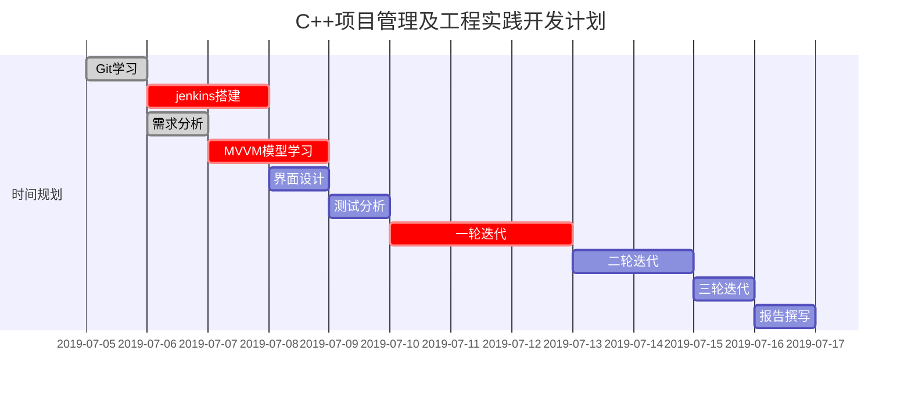
## 分工

### 第一轮迭代

| 姓名    | 任务 |
| :----- | ---- |
| 邵尧    |  view层和持续集成jenkins工具的搭建    |
| 周章华   | viewmodel层和model层的搭建以及app层组装 |
| 周国晨 | model层的三次样条插值拟合算法以及common层架构 |

### 第二轮迭代

| 姓名   | 任务 |
| -----	| ---- |
| 邵尧   | model层与算法层的修改，多项式函数拟合算法 |
| 周章华 | view层添加图像的显示,添加图像显示的功能 |
| 周国晨 | viewmodel层与model层的函数图像坐标范围计算 |

### 第三轮迭代

| 姓名   | 任务 |
| ----- | ---- |
| 邵尧   |  model层与viewmodel层，增加更多函数拟合选项    |
| 周章华 | model层与算法层，指数与对数拟合算法 |
| 周国晨 | view层功能添加，界面设计 |

## 每轮迭代结果

### 第一轮迭代

#### v1.0 

- 基于MVVM模型实现了对左侧表格中数据进行线性拟合的功能，如图所示：

  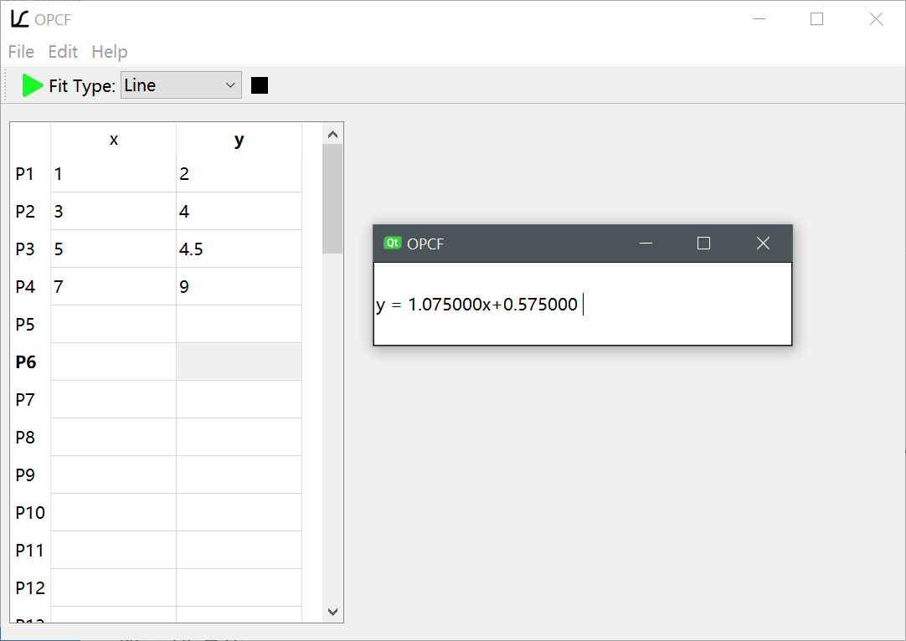

#### v1.1

-  完善了MVVM模型。运行效果与v1.0版本相同。

### 第二轮迭代

#### v2.0

- 实现多种类型函数拟合以及显示拟合函数图像的功能：

  - 一次函数

    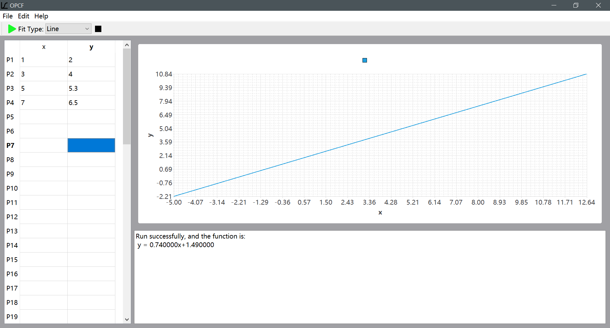

  - 二次函数

    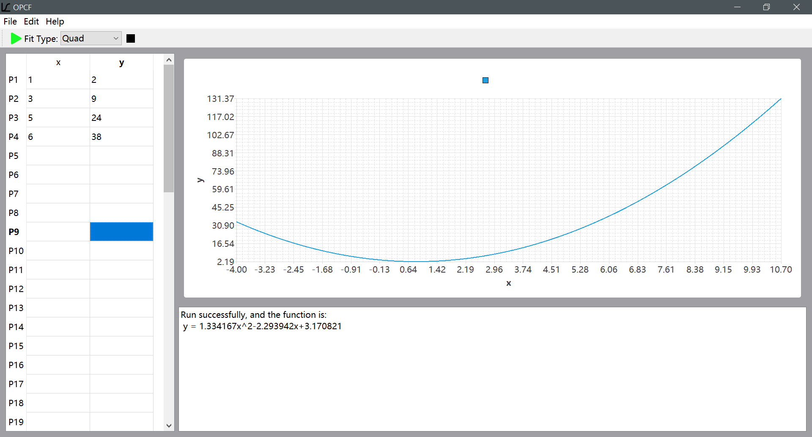

  - 指数函数

    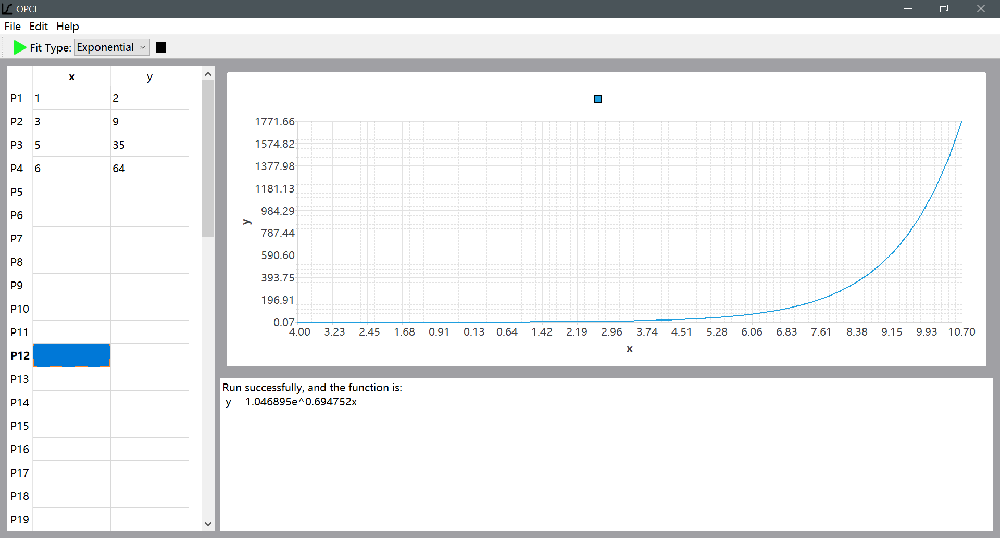

  - 对数函数

    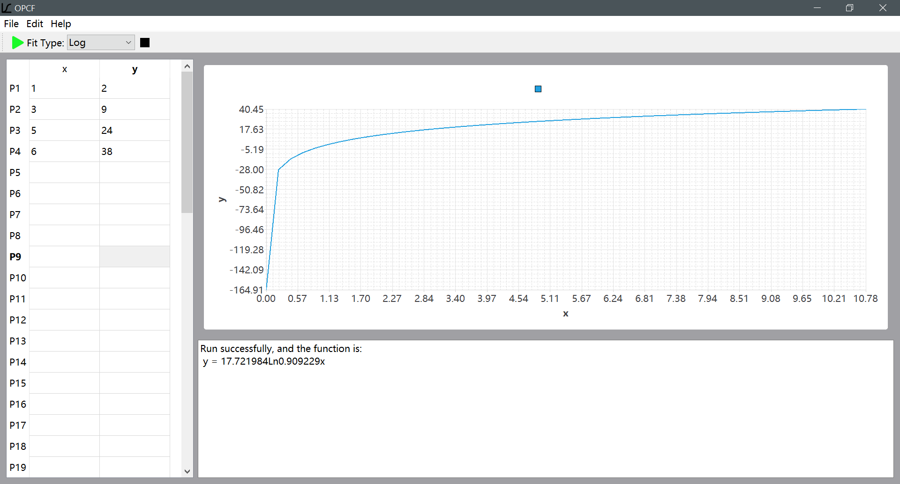

- 实现了错误的检测与错误输出，错误输出包括两个部分

  - 底部输出框显示错误信息
  - 函数图像区显示出错提醒

#### v2.1

- 添加显示样本点以及鼠标对应点坐标值的功能

  

### 第三轮迭代

#### v3.0

- 美观友好的UI设计

  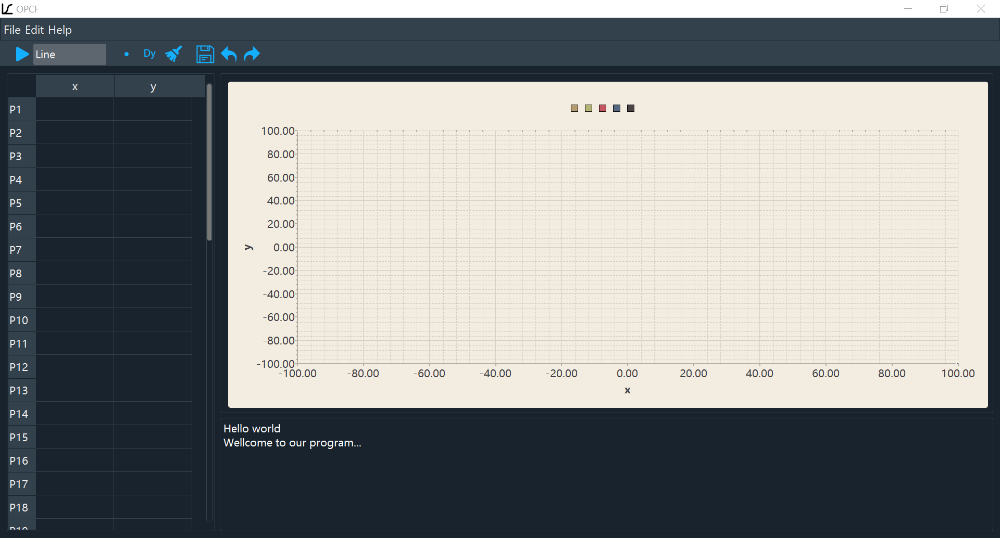

- 添加三次样条插值拟合功能

  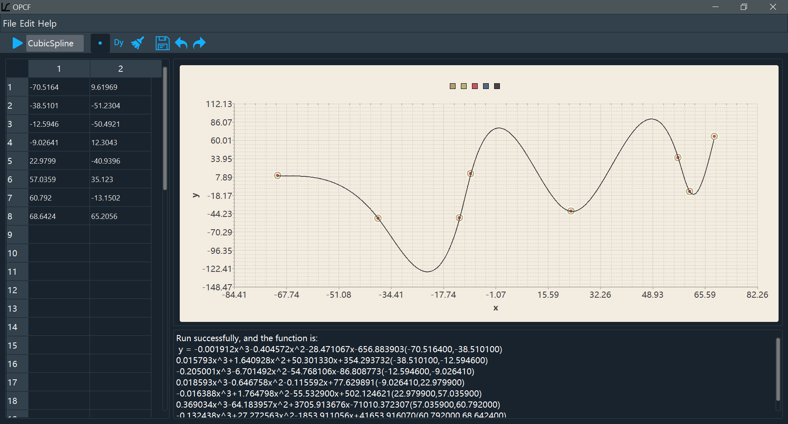

- 添加显示导函数的功能

  

- 添加撤销、重做功能

- 添加文件保存、载入功能

- 添加直接在函数图像上添加、移动点的功能

- 添加帮助文档

- 添加清楚所有数据的功能

## 最终运行效果图

- 直接在图像上添加点，选择三次样条插值拟合，点击运行，可以看到函数图像和对应的函数方程。

  

- 点击工具栏中的Dy图标，显示到函数图像

  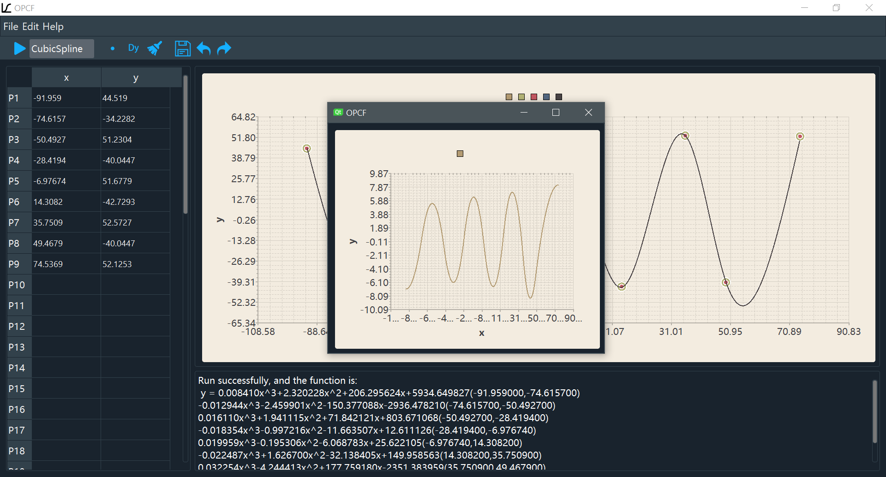

- 点击工具栏中的保存按钮，将数据保存为txt文件

  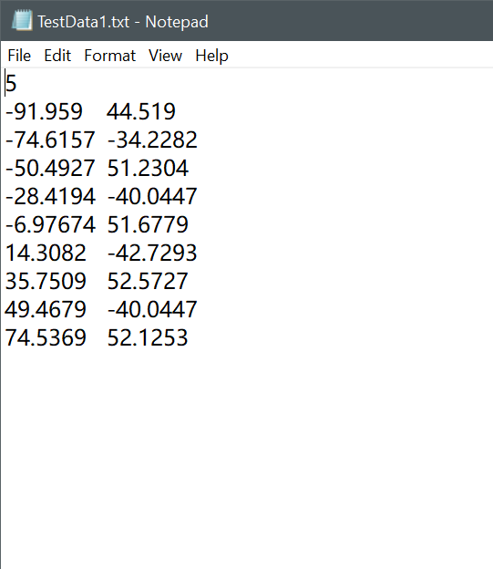

- 点击工具栏中的清除按钮，删除所有数据

  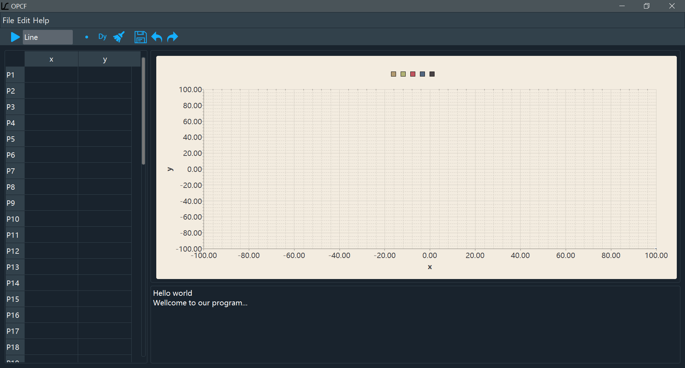

- 点击菜单栏中的打开文件，将数据导入软件

  

- 选择三次函数拟合，运行

  

- 点击工具栏中的撤销按钮，回退到上次运行的状态

  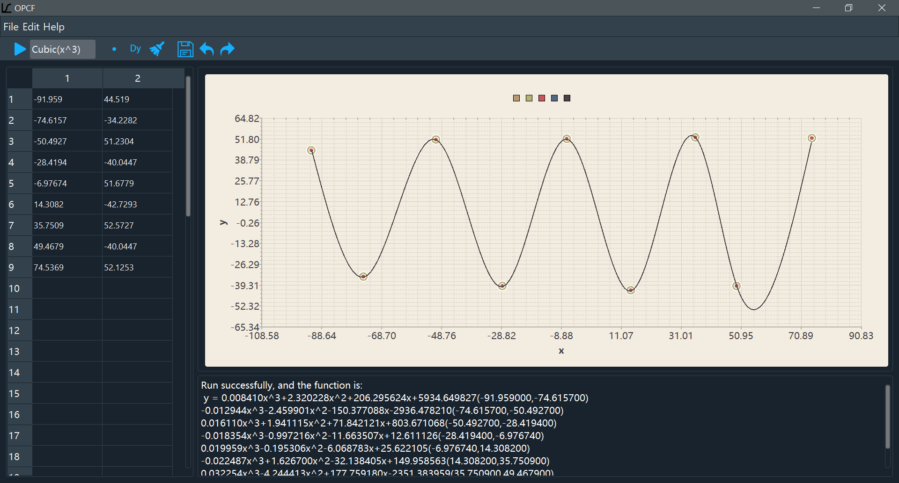

- 点击工具栏中的重做按钮，返回更新一次的运行状态

- 

- 点击工具栏中的导入excel文件，将数据导入软件

  

- 点击菜单栏中的帮助，显示帮助文档

  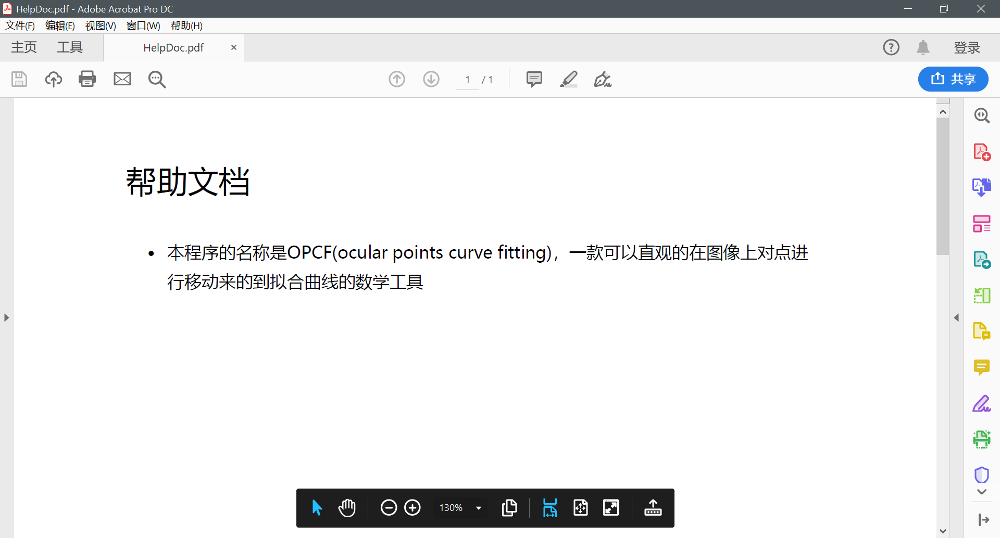
